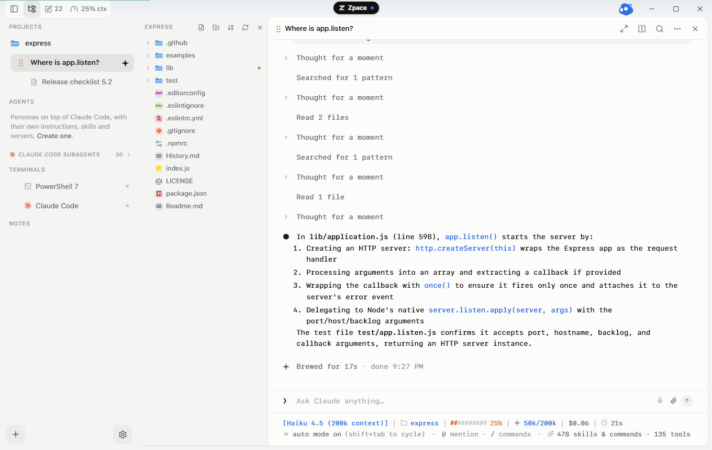
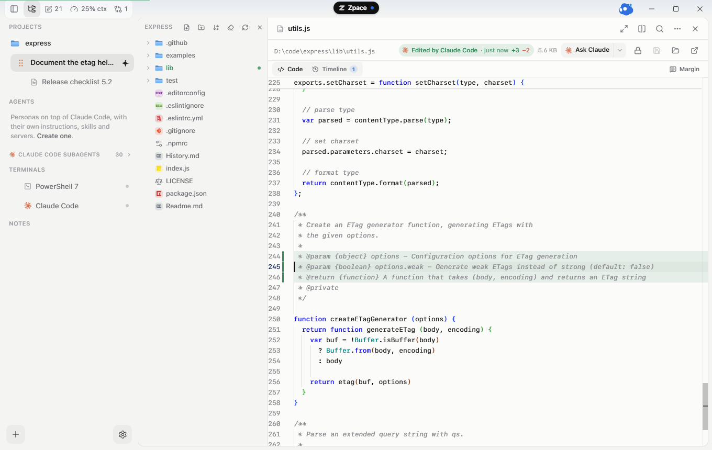
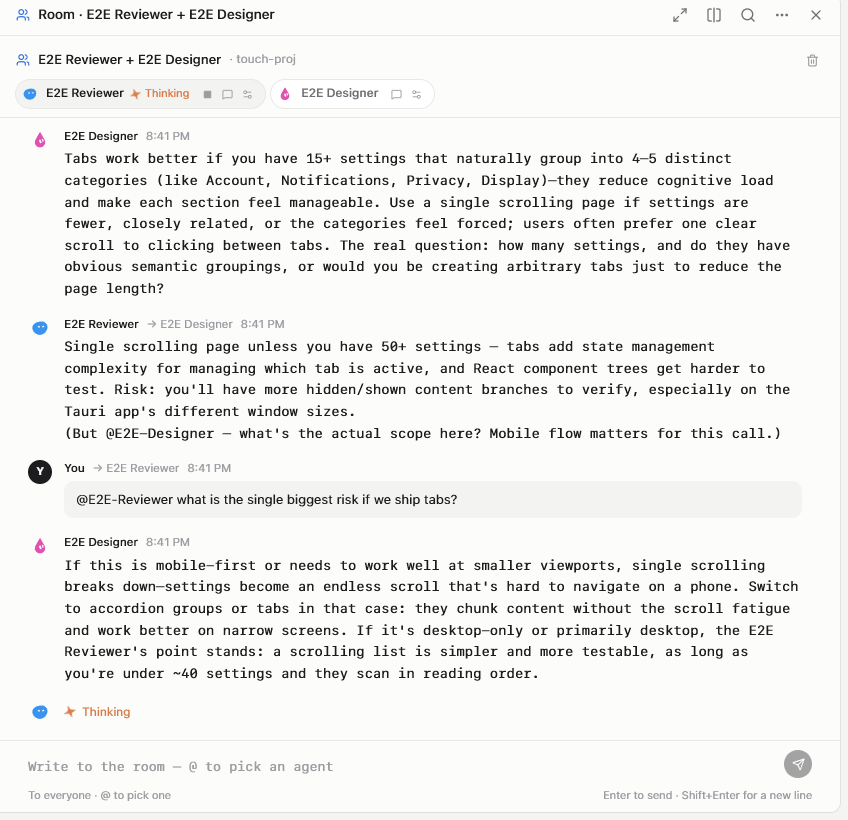
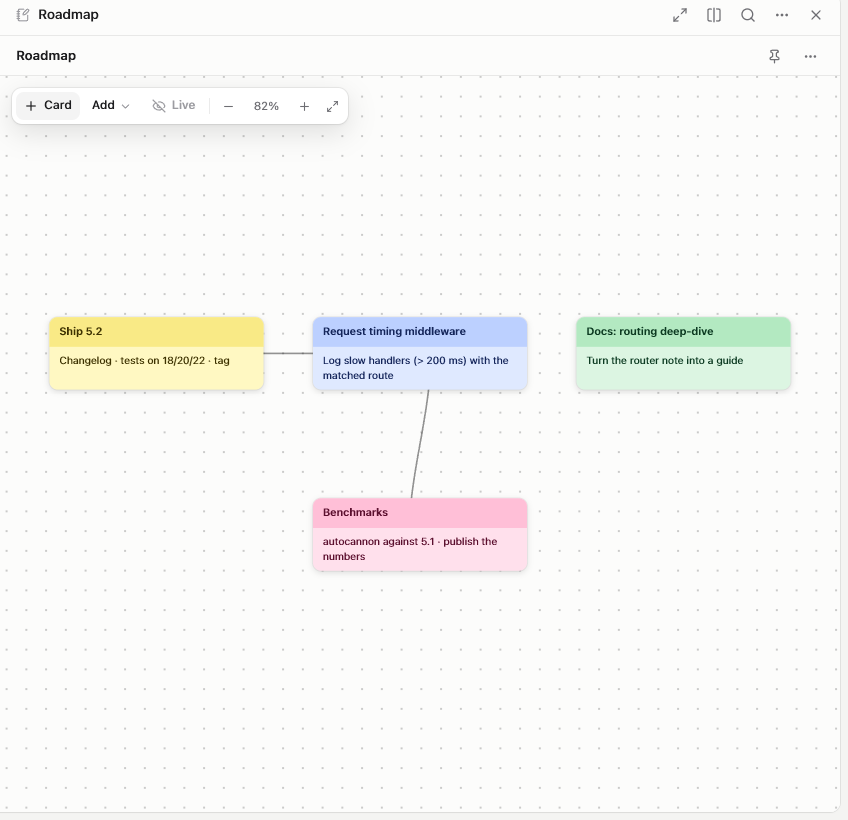

<p align="center">
  <a href="https://nicoo01x.github.io/Zpace/"></a>
</p>

<h1 align="center">Zpace</h1>

<p align="center">
  The desktop workspace for coding agents.<br>
  Claude Code, Codex, Gemini CLI and OpenCode in one window — with the terminals, editor, notes, git and browser you keep leaving the terminal for.
</p>

<p align="center">
  <a href="https://nicoo01x.github.io/Zpace/">Website</a> ·
  <a href="https://github.com/Nicoo01x/Zpace/releases/latest">Download</a> ·
  <a href="https://github.com/Nicoo01x/zpace-plugins">Plugins</a> ·
  <a href="docs/FEATURES.md">Every feature</a> ·
  <a href="docs/DEVELOPMENT.md">Development</a>
</p>

<p align="center">
  <a href="https://github.com/Nicoo01x/Zpace/releases/latest"></a>
  <a href="https://github.com/Nicoo01x/Zpace/releases"></a>
  <a href="https://github.com/Nicoo01x/Zpace/actions/workflows/build.yml"></a>
  
</p>

<p align="center">
  
</p>

## What it is

Zpace is a native desktop app (Tauri 2 + React) that gives your coding agents a home. Every project keeps its sessions, terminals, notes, boards and layout; close the app, open it a week later, and it is exactly where you left it.

- **Agents, side by side** — Claude Code as a structured chat (permissions, diffs, tokens, cost) or as its own TUI; Codex, Gemini CLI and OpenCode one click away in any folder.
- **The island** — a notification centre in the title bar: an agent finished, a question is waiting, a commit landed, the timer, the track playing. It unfolds, you glance, it folds.
- **The window** — a real editor with a timeline of what agents changed, a review pane to keep or discard per hunk, a git panel, real terminals, an embedded browser, notes with formatting and boards with cards.
- **Not one assistant, a team** — agents are personas on top of Claude Code with their own instructions, skills and MCP servers; put several in a room with `@` mentions; race variants in an arena, each in its own worktree, and merge the best.
- **Plugins** — a library inside the app fed by the open [zpace-plugins](https://github.com/Nicoo01x/zpace-plugins) registry: boards, a focus timer, Now Playing, a calendar, weather, themes, agents and skills. Publish yours with a pull request, under your own name.
- **Free forever, local-first** — no account, no cloud, no telemetry. Updates come from GitHub releases, plugins from the registry, and nothing leaves your machine unless you ask.

<table>
  <tr>
    <td width="33%"></td>
    <td width="33%"></td>
    <td width="33%"></td>
  </tr>
  <tr>
    <td align="center"><sub>The editor, with what the agent wrote</sub></td>
    <td align="center"><sub>A room: two agents, one conversation</sub></td>
    <td align="center"><sub>Boards next to the work</sub></td>
  </tr>
</table>

## Download

| Platform | File |
| --- | --- |
| Windows 10 / 11 (x64) | [`Zpace_<version>_x64-setup.exe`](https://github.com/Nicoo01x/Zpace/releases/latest) |
| macOS 12+ (Apple Silicon and Intel) | [`Zpace_<version>_universal.dmg`](https://github.com/Nicoo01x/Zpace/releases/latest) |
| Linux (Debian / Ubuntu) | [`Zpace_<version>_amd64.deb`](https://github.com/Nicoo01x/Zpace/releases/latest) |
| Linux (Fedora / RHEL) | [`Zpace-<version>-1.x86_64.rpm`](https://github.com/Nicoo01x/Zpace/releases/latest) |
| Linux (any) | [`Zpace_<version>_amd64.AppImage`](https://github.com/Nicoo01x/Zpace/releases/latest) |

Every file is signed for the in-app updater, which checks this repository's releases at launch and shows you the notes before it does anything. Windows shows a SmartScreen notice on the first run until the app carries a code-signing certificate (*More info → Run anyway*); macOS is not notarised yet (right-click → *Open* the first time).

Zpace drives the CLIs you already have: install [Claude Code](https://docs.anthropic.com/en/docs/claude-code), and optionally Codex, Gemini CLI or OpenCode, and the first-run wizard finds them.

## Plugins

Settings › Plugins is a library. A plugin is a folder with a `plugin.json`, maybe a script that gets a `zpace` API (palette commands, island readouts and cards, panes, notes, media, storage — gated by the permissions it declares), maybe an HTML pane, maybe a theme, an agent or a skill. The [registry](https://github.com/Nicoo01x/zpace-plugins) documents the whole API and has the template; the app shows who made each one.

## Building it

```bash
npm install
npm run dev          # the web side on 127.0.0.1:1420
npm run tauri:dev    # the desktop app against it
```

Node 20+, Rust stable, and the platform's webview toolchain. [docs/DEVELOPMENT.md](docs/DEVELOPMENT.md) has the architecture, the Claude Code integration and the keyboard; [CLAUDE.md](CLAUDE.md) has the conventions for code, design and motion.

## Contributing

Issues and pull requests are welcome — read [CONTRIBUTING.md](CONTRIBUTING.md) first (it is short). `main` is protected: the checks run on Windows, macOS and Linux, and every pull request is reviewed before it merges. Security reports go through the [advisory form](https://github.com/Nicoo01x/Zpace/security/advisories/new), never a public issue.

## Made by

<a href="https://github.com/Nicoo01x"></a>
**Nicolás Cabanillas** — [@Nicoo01x](https://github.com/Nicoo01x), Argentina. If Zpace is useful to you, a star helps other people find it.
